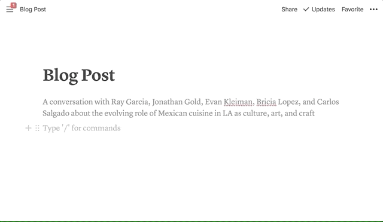

# notion-ga

Proxy server that allows you to track pageview events via google analytics. It uses notion's embed image feature to send pageview event to google analytics.



## How to use?

1. Start notion-ga server and deploy it to the internet world (Optional)
2. Build URL with parameters according to the Parameter reference guide
3. Add embed image to notion pages you want to track. (with the URL you built at the previous step)

## Parameter reference

| Key  | Description                                             | Example                   | Required |
| ---- | ------------------------------------------------------- | ------------------------- | -------- |
| tid  | Google Analytics tracking ID                            | UA-99123456-1             | Y        |
| host | Specifies the hostname from which content was hosted.   | mskim.me                  | Y        |
| Page | The path portion of the page URL. Should begin with `/` | /careers/product-designer | Y        |

### Example URLs

- https://notion-ga.ohwhos.now.sh/collect?tid=UA-97180334-1&host=mskim.me&page=/careers/product-designer
- https://notion-ga.ohwhos.now.sh/collect?tid=UA-97180334-1&host=mskim.me&page=/careers/data-engineer

## Development

### Requirements

- `Node.js@^8`

### 1. Install dependencies

```bash
$ npm install now@^15 --global
```

### 2. Run development server

```bash
$ now dev
```

### 3. Deploy to the internet world

```bash
$ now
```

## Contributions

Issues and PRs are welcome. Do not hesitate to do it. Please do.

## LICENSE

MIT
